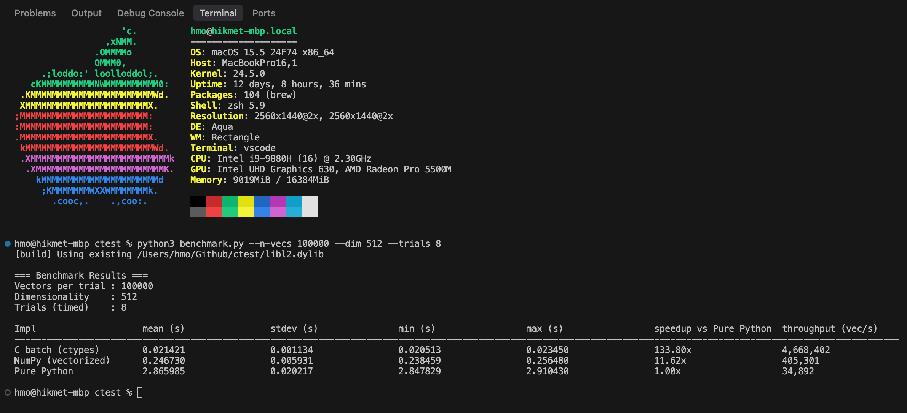

# Euclidean Distance Benchmark

Measure the performance of different implementations of the Euclidean (L2) distance between large batches of float32 vectors:

* **Pure-Python** reference implementation
* **NumPy** vectorised routine (`np.linalg.norm`)
* **Hand-written C** kernel exposed to Python through `ctypes`

The goal is to provide an easily-runnable micro-benchmark that shows the massive speed-ups you can obtain by moving from naïve Python code to vectorised or native alternatives.

---

## Repository layout

File | Purpose
--- | ---
`benchmark.py` | Main benchmark driver (Python 3). Automatically builds and loads the C shared library on first run.
`l2.c`, `l2.h` | Scalar C implementation of batched L2 distance.
`make` | Minimal Makefile for manual compilation on Linux/macOS.
`results.png` | Example results produced on one machine using the default settings.

## Dependencies

Mandatory:

* Python **3.8+**
* [NumPy](https://numpy.org/) ≥ 1.20

Native build requirements (only if you want to include the C benchmark):

* A C99-compatible compiler – GCC, Clang or MSVC
* (Optional) `make` if you prefer using the provided Makefile instead of the auto-builder

> **Note**
> On Windows the auto-builder is disabled. Compile `l2.c` into `l2.dll` manually (see the build commands in the source header) and place it next to `benchmark.py`.

> **macOS note**
> A universal (arm64 & x86_64) `libl2.dylib` is already included in the repository. If it loads successfully, **no compilation is required**—just run `python benchmark.py`. Pass `--rebuild` to force recompilation if desired.

> **Linux note**
> The macOS `.dylib` will not load on Linux; the script will transparently compile `libl2.so` on the first run provided a C compiler is available (use `--rebuild` to force a fresh build later).

## Quick start

Create a fresh environment (highly recommended) and install NumPy:

```bash
python -m venv venv
source venv/bin/activate    # PowerShell: venv\Scripts\Activate.ps1
pip install --upgrade pip
pip install numpy
```

Run the benchmark with default settings (100 k vectors of 512 floats, 10 timed trials):

```bash
python benchmark.py
```

Typical output:

```
=== Benchmark Results ===
Vectors per trial : 100000
Dimensionality    : 512
Trials (timed)    : 10

Impl                   mean (s)          stdev (s)         min (s)          max (s)          speedup vs Pure Python  throughput (vec/s)
--------------------------------------------------------------------------------------------------------------
Pure Python            4.382614          0.012105          4.366492          4.405879        1.00x               22,824
NumPy (vectorized)     0.031339          0.000442          0.030895          0.032371      139.84x          3,190,710
C batch (ctypes)       0.013519          0.000139          0.013337          0.013754      324.18x          7,394,185
```

> *Numbers above were produced on an Apple M2 (arm64) laptop running macOS 14.5 – your mileage may vary.*

### Changing workload parameters

Flag | Meaning | Default
--- | --- | ---
`--n-vecs` | Number of vector pairs to benchmark | 100 000
`--dim` | Dimensionality of each vector | 512
`--trials` | Timed repetitions | 10
`--warmup` | Untimed warm-up runs | 2

You can also selectively disable implementations:

```bash
# Skip C benchmark (e.g., no compiler available)
python benchmark.py --no-c

# Only run the C version, rebuild the library, suppress build chatter
python benchmark.py --no-numpy --no-python --rebuild --quiet
```

## Building the shared library manually (optional)

If you prefer to build the C library yourself, run:

```bash
# Linux
make

# macOS (same – Makefile auto-detects platform)
make

# Clean build artefacts
make clean
```

The resulting `libl2.so` (Linux) or `libl2.dylib` (macOS) will be picked up automatically by `benchmark.py`.

### Custom compile flags

Set environment variables `CC`, `CFLAGS` or `LDFLAGS` before building, for example:

```bash
CC=clang CFLAGS="-O3 -march=native -ffast-math -fno-math-errno" make
```

## Results  

Below is a results printout from a sample run. Feel free to regenerate it on your own hardware.



---

## License

This project is released under the MIT License – see the source files for details.
